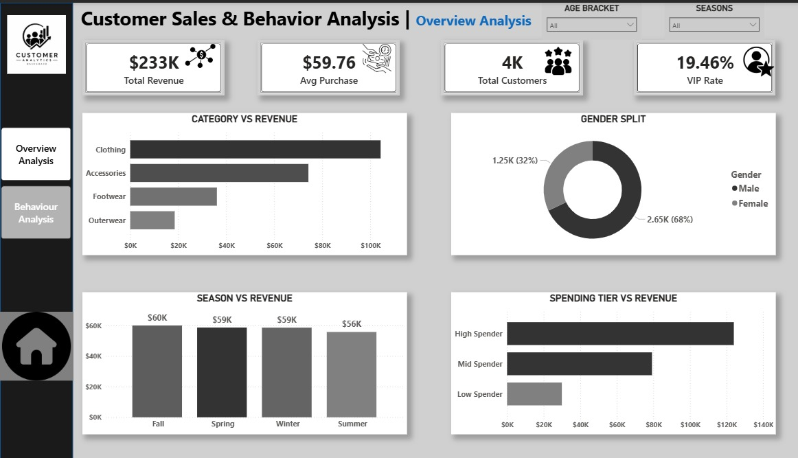

# 🛍️ Customer Sales & Behavior Analysis Dashboard

A data analytics project focused on understanding customer spending patterns, purchasing behavior, and sales performance to support strategic business decisions.

---

## 📌 Project Objective

The goal of this project is to analyze customer and sales data in order to:
- Identify key revenue drivers  
- Understand customer demographics and behavior  
- Evaluate product category performance  
- Analyze seasonal and regional sales trends  
- Provide actionable business recommendations  

---

## 📊 Dashboard Preview

### Dashboard View 1

### Dashboard View 2

> Built using Power BI to visualize customer insights, sales performance, and business trends.

## 🛠 Tools Used
- Power BI (Data Visualization & Dashboard Design)  
- SQL (Data Analysis & Querying)  
- Excel (Data Cleaning & Preparation)  

## 📈 Business Insights

### 1. Strong Revenue Performance
The business generated:
- **$233K total revenue**
- **4K customers**
- **$59.76 average purchase value**

👉 This indicates strong customer spending and stable sales performance.

### 2. Clothing is the Top Performing Category
Clothing outperformed all other categories:
- Accessories  
- Footwear  
- Outerwear  

👉 Customers spend more on clothing compared to other product categories.

### 3. Female Customers Drive Majority of Sales
Customer distribution:
- **68% Female**
- **32% Male**

👉 Female customers contribute the highest share of purchases.

### 4. Seasonal Sales Peak in Fall
- Highest revenue recorded in **Fall**
- Spring and Winter followed closely  
- **Summer recorded the lowest sales**

👉 Customer spending increases significantly during Fall season.

### 5. High Spenders Drive Revenue
- High Spenders contributed the largest share of revenue  
- Mid and Low Spenders contributed significantly less  

👉 A small customer segment drives a large portion of revenue.

### 6. Gen Z Customers Are Highly Valuable
- Gen Z average spending: **$60.20**

👉 Younger customers show higher engagement and spending behavior.

### 7. Payment Method Preference
- **84.18%** used preferred payment methods  
- **15.82%** used alternative payment methods  

👉 Customers prioritize convenience and familiar payment options.

### 8. Fast Shipping Increases Spending
Customers using:
- 2-Day Shipping  
- Express Shipping  

👉 Tend to spend more than standard shipping users.

### 9. Top Performing States
Highest purchasing activity came from:
- Montana  
- California  
- Idaho  

👉 These regions represent key markets for expansion and targeting.

## 💡 Business Recommendations

- Focus marketing on **Clothing category** (top revenue driver)  
- Run targeted campaigns for **Female and Gen Z customers**  
- Strengthen loyalty programs for **High Spenders**  
- Increase promotions during **Fall season peaks**  
- Encourage **Express and 2-Day Shipping** options  
- Develop **location-based campaigns** for top states (Montana & California)  

---

## 🚀 Key Learning Outcomes

- Built a complete end-to-end Power BI dashboard project  
- Applied SQL for data extraction and insight generation  
- Performed customer segmentation and behavioral analysis  
- Translated raw data into actionable business insights  
- Strengthened portfolio readiness for data analyst roles  

**Focus Area:** Economics | Data Analytics  
**Skills:** SQL | Power BI | Excel | Business Intelligence
